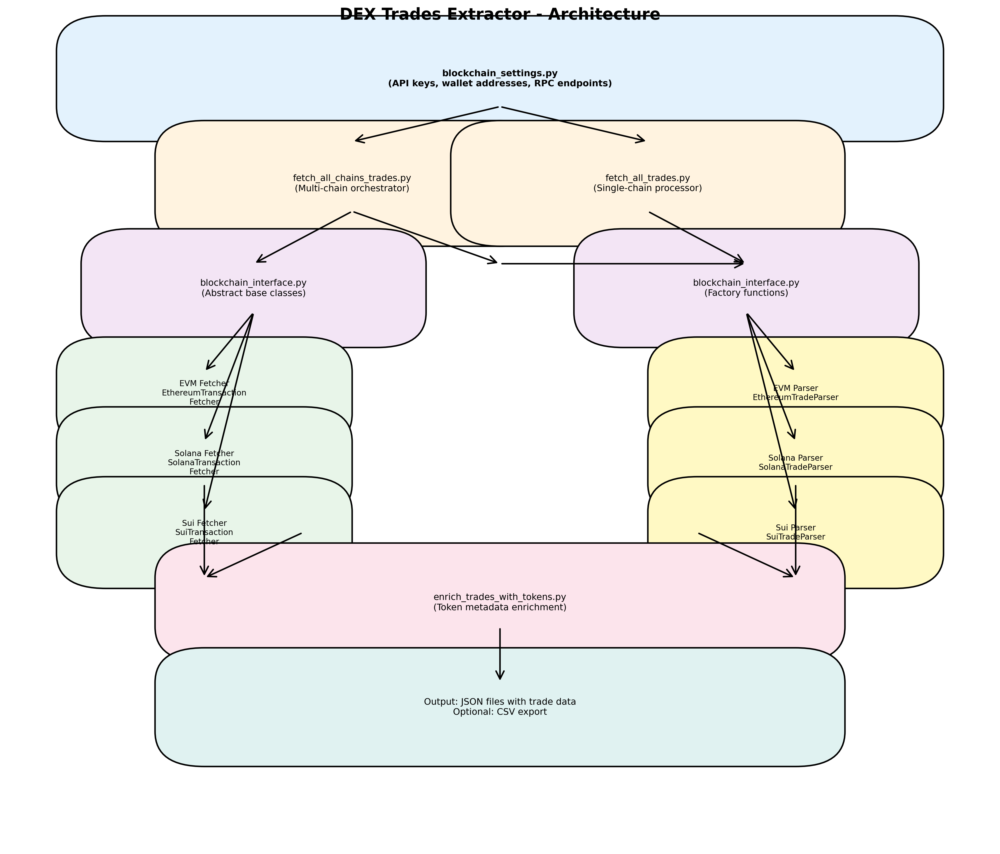

# DEX Trades Extractor

A comprehensive tool to extract **ALL** DEX (Decentralized Exchange) trades from wallet addresses across multiple blockchains. The tool identifies and extracts swap transactions from all major DEX protocols using pattern matching and transaction analysis.

## Goal

The primary goal of this tool is to provide a reliable, comprehensive solution for extracting DEX swap trades from blockchain transaction history. It focuses on:

- **Complete Coverage**: Detects trades from all major DEX protocols, not just specific ones
- **Multi-Chain Support**: Works across multiple EVM-compatible and non-EVM blockchains
- **Pattern-Based Detection**: Uses multiple detection strategies to catch swaps even from unknown DEX protocols
- **Accurate Identification**: Filters out simple transfers, focusing only on actual swap transactions

## Supported Blockchains

### EVM Chains
- **Ethereum** (Mainnet)
- **Monad**
- **Base**
- **Arbitrum**
- **Optimism**
- **Polygon**
- **Linea**
- **Katana** (Ronin)
- **Binance Smart Chain** (BSC)
- **Avalanche** (AVAX)

### Non-EVM Chains
- **Solana**
- **Sui**

## Supported DEX Protocols

The tool automatically detects trades from all major DEXes via pattern matching:

- Uniswap V2 & V3
- SushiSwap
- Curve Finance
- 1inch (V4 & V5)
- Balancer V2
- 0x Protocol
- KyberSwap
- DODO
- Paraswap
- CowSwap (CoW Protocol)
- Bancor Network
- And more (any swap detected via transfer pattern analysis)

The system uses multiple detection strategies, so even if a DEX is not explicitly listed, swaps are still detected by analyzing ERC-20 transfer patterns (sending token A and receiving token B = swap).

## Architecture

The system is built using an abstraction layer that supports multiple blockchain types:



### Core Components

1. **`blockchain_interface.py`**: Abstract base classes defining the interface for transaction fetchers and trade parsers. Provides factory functions to get the appropriate implementation for each chain.

2. **Transaction Fetchers**: Chain-specific classes that fetch transaction data from blockchain explorers or RPC endpoints:
   - `EthereumTransactionFetcher`: For all EVM chains (uses Etherscan API)
   - `SolanaTransactionFetcher`: For Solana (uses Solana RPC)
   - `SuiTransactionFetcher`: For Sui (uses Sui RPC)

3. **Trade Parsers**: Chain-specific classes that analyze transactions and identify DEX swaps:
   - `EthereumTradeParser`: For EVM chains (analyzes ERC-20 transfers, function signatures, router addresses)
   - `SolanaTradeParser`: For Solana (analyzes SPL token transfers)
   - `SuiTradeParser`: For Sui (analyzes coin transfers)

4. **Configuration Files**:
   - `chains_config.py`: Chain configurations (API endpoints, chain IDs, native tokens)
   - `ethereum_config.py`: DEX router addresses and function signatures (EVM-specific)
   - `blockchain_settings.py`: User configuration (API keys, wallet addresses)

5. **Main Scripts**:
   - `fetch_all_chains_trades.py`: Processes all configured chains and addresses
   - `fetch_all_trades.py`: Processes a single chain for all configured addresses
   - `get_ethereum_trades.py`: Ethereum-only alternative (legacy interface)

## Design

### Multi-Chain Abstraction

The system uses an abstraction layer (`blockchain_interface.py`) that defines standard interfaces for transaction fetching and trade parsing. This allows support for different blockchain types (EVM, Solana, Sui) while maintaining a consistent codebase structure.

### DEX Detection Strategies

For EVM chains, the parser uses multiple strategies to identify DEX swaps:

#### Strategy 1: DEX Router Detection
- Checks if transactions interact with known DEX router addresses
- Identifies DEX by router contract address
- Router addresses are defined in `ethereum_config.py`

#### Strategy 2: Function Signature Matching
- Analyzes transaction input data (first 4 bytes)
- Matches against 20+ known swap function signatures
- Examples: `swapExactTokensForTokens`, `exactInputSingle`, `transformERC20`

#### Strategy 3: Transfer Pattern Analysis
- Groups ERC-20 transfers by transaction hash
- Identifies swaps when the wallet sends one token and receives another
- Handles multiple transfers of the same token (aggregates amounts)
- This strategy catches swaps even from unknown DEX protocols

#### Strategy 4: Native Token Swap Detection
- Detects swaps involving native tokens (ETH, BNB, etc.)
- Matches native token transfers with ERC-20 transfers
- Handles wrapped token wrapping/unwrapping

### Trade Filtering

The parser implements strict filtering to ensure only actual swaps are identified:

- **Must be a swap**: User must send one token AND receive a different token
- **Different tokens**: `token_in != token_out` (prevents self-transfers)
- **Both amounts > 0**: Both input and output amounts must be positive
- **Must send something**: At least one token must be sent (filters out airdrops/rewards)

This filtering excludes:
- Simple transfers (send token A to address B)
- Airdrops (only receive tokens, don't send)
- Protocol deposits/withdrawals (identified by protocol token patterns)

### Output Format

The tool outputs trade data in JSON format with the following structure:

```json
{
  "address": "0x...",
  "total_trades": 150,
  "trades": [
    {
      "tx_hash": "0x...",
      "block_number": 18500000,
      "timestamp": 1690000000,
      "dex": "Uniswap V2",
      "token_in": "0x...",
      "token_out": "0x...",
      "amount_in": "1000000000000000000",
      "amount_out": "2000000000000000000",
      "type": "swap"
    },
    ...
  ],
  "metadata": {
    "parsed_at": "2024-01-01 12:00:00 UTC",
    "total_transactions": 500,
    "total_token_transfers": 300
  }
}
```

After enrichment with token metadata, trades include additional fields:
- `token_in_metadata`: Token name, symbol, decimals
- `token_out_metadata`: Token name, symbol, decimals
- `amount_in_formatted`: Human-readable amount
- `amount_out_formatted`: Human-readable amount

Optional CSV export is available (see usage section).

## Installation

### Prerequisites

- Python 3.7 or higher
- API keys for blockchain explorers (see below)

### Step 1: Clone the Repository

```bash
git clone <repository-url>
cd ethereum_tx_tracking
```

### Step 2: Install Python Dependencies

```bash
pip install -r requirements.txt
```

Required packages:
- `requests`: For API calls
- `python-dotenv`: For environment variable support (optional)

### Step 3: Configure Settings

1. Copy the example settings file:
   ```bash
   cp blockchain_settings.py.example blockchain_settings.py
   ```

2. Edit `blockchain_settings.py` and configure:
   - **API Keys**: Get free API keys from blockchain explorers
   - **Wallet Addresses**: Add the addresses you want to analyze
   - **RPC Endpoints**: (Optional) For non-EVM chains, configure custom RPC endpoints

#### Getting API Keys

**EVM Chains (Etherscan API V2)**:
- **Ethereum**: https://etherscan.io/apis (free tier: 5 calls/sec)
- **Base**: https://basescan.org/apis
- **Arbitrum**: https://arbiscan.io/apis
- **Optimism**: https://optimistic.etherscan.io/apis
- **Polygon**: https://polygonscan.com/apis
- **Avalanche**: https://snowtrace.io/apis
- **Binance Smart Chain**: Note - BSCScan API was deprecated in Dec 2025. The tool uses direct RPC calls instead.

**Non-EVM Chains**:
- **Solana**: Uses public RPC (no key needed) or configure custom RPC endpoint
- **Sui**: Uses public RPC (no key needed) or configure custom RPC endpoint

#### Example Configuration

```python
# blockchain_settings.py
ETHERSCAN_API_KEY = "your_etherscan_api_key_here"

# Chain-specific API keys (optional - fallback to ETHERSCAN_API_KEY)
API_KEYS = {
    'ethereum': 'your_etherscan_key',
    'base': 'your_basescan_key',  # Optional
    'arbitrum': 'your_arbiscan_key',  # Optional
    # ... etc
}

# Wallet addresses to process
WALLET_ADDRESSES = [
    "0xYourFirstWalletAddress",
    "0xYourSecondWalletAddress",
]

# Optional: RPC endpoints for non-EVM chains
RPC_ENDPOINTS = {
    'solana': 'https://api.mainnet-beta.solana.com',  # Public RPC (default)
    'sui': 'https://fullnode.mainnet.sui.io:443',  # Public RPC (default)
}
```

**Important**: `blockchain_settings.py` is gitignored to protect your API keys and addresses. Never commit this file!

#### Alternative: Environment Variables

Instead of editing the settings file, you can use environment variables:

```bash
export ETHERSCAN_API_KEY="your_api_key"
export WALLET_ADDRESSES="0xAddress1,0xAddress2"
```

Or create a `.env` file:
```
ETHERSCAN_API_KEY=your_api_key
WALLET_ADDRESSES=0xAddress1,0xAddress2
```

## Usage

### Quick Start: Process All Chains

The simplest way to extract trades from all configured chains and addresses:

```bash
python fetch_all_chains_trades.py
```

This will:
1. Process all supported EVM chains
2. Process all wallet addresses in `WALLET_ADDRESSES`
3. Fetch transactions from each chain
4. Parse and identify DEX trades
5. Enrich with token metadata
6. Export to `evm_trades.csv`

### Process Specific Chains

To process only specific chains, use `fetch_all_trades.py`:

```bash
# Process all EVM chains
python fetch_all_trades.py evm

# Process a single chain
python fetch_all_trades.py ethereum
python fetch_all_trades.py base
python fetch_all_trades.py arbitrum
python fetch_all_trades.py binance
python fetch_all_trades.py solana
python fetch_all_trades.py sui
```

### Ethereum-Only Alternative

For Ethereum-only extraction, you can use the legacy interface:

```bash
python get_ethereum_trades.py YOUR_API_KEY 0xYourWalletAddress
```

Or configure in `blockchain_settings.py` and run:
```bash
python get_ethereum_trades.py
```

This saves results to `ethereum_trades.json`.

### Output Files

The tool generates several output files:

#### JSON Files (Intermediate)

- `wallet_trades_{chain}_{address_suffix}.json`: Raw transaction data from explorer
- `{chain}_trades_{address_suffix}.json`: Parsed trades (before enrichment)
- `{chain}_trades_enriched_{address_suffix}.json`: Trades with token metadata

#### CSV Files (Final Output)

- `evm_trades.csv`: All trades from all EVM chains (when using `fetch_all_chains_trades.py`)
- `trades.csv`: All trades from all chains including non-EVM (when using `fetch_all_trades.py`)
- `{chain}_trades.csv`: Trades from a specific chain (when using `fetch_all_trades.py {chain}`)

CSV format (tab-separated):
```
date_time	source_currency	source_amount	target_currency	target_amount	platform	address
2025/01/02 22:15:59	USDC	18987.522451	USD	18987.52	monad	0xb77Cb8F81A0f704E1E858EBa57C67c072ABBFCAD
2025/01/02 22:15:59	USD	18987.52	edgeUSDC	18981.235905	monad	0xb77Cb8F81A0f704E1E858EBa57C67c072ABBFCAD
```

### Advanced Usage

#### Process Single Chain for Single Address

The `fetch_all_trades.py` script can also process a single chain for a single address. This requires modifying the script or calling it programmatically.

#### Custom Output Location

Edit `blockchain_settings.py` to change default output file names, or modify the scripts directly.

#### Filter Chains

Edit `chains_config.py` to modify `SUPPORTED_CHAINS` and only include the chains you want:

```python
# chains_config.py
SUPPORTED_CHAINS = ['ethereum', 'base', 'arbitrum']  # Only these chains
```

## Troubleshooting

### No trades found

- **Check your address**: Verify the address format (0x followed by 40 hex characters for EVM)
- **Verify transactions exist**: Check the blockchain explorer directly
- **Check chain support**: Ensure the chain is in `SUPPORTED_CHAINS` in `chains_config.py`

### API errors (403, rate limit, etc.)

- **Verify API key**: Check your API key is valid and active
- **Check rate limits**: Free tier Etherscan API allows 5 calls/second - wait if rate limited
- **Optimism**: May require chain-specific API key or paid Etherscan plan
- **BSC (Binance Smart Chain)**: Uses direct RPC calls (no API key needed, but may be slower)

### Missing trades

- **DEX not recognized**: The tool uses pattern matching, so it should catch most swaps even if DEX is unknown
- **Non-standard swaps**: Some protocols use unique patterns - check transaction on explorer manually
- **Low-value swaps**: All swaps are included regardless of size

### Import errors

- **Missing dependencies**: Run `pip install -r requirements.txt`
- **Python version**: Requires Python 3.7 or higher
- **Module not found**: Check that you're in the project directory

## Project Structure

```
.
├── README.md                          # This file
├── requirements.txt                   # Python dependencies
├── blockchain_settings.py.example     # Settings template
├── blockchain_settings.py             # Your settings (gitignored)
│
├── Main Scripts
├── fetch_all_chains_trades.py        # Multi-chain orchestrator (recommended)
├── fetch_all_trades.py                # Single-chain processor
├── get_ethereum_trades.py             # Ethereum-only alternative
│
├── Core Components
├── blockchain_interface.py            # Abstract base classes & factory functions
├── chains_config.py                   # Chain configurations
├── ethereum_config.py                 # DEX router addresses & function signatures
│
├── Transaction Fetchers
├── fetch_ethereum_transactions.py    # EVM chain fetcher
├── fetch_solana_transactions.py      # Solana fetcher
├── fetch_sui_transactions.py         # Sui fetcher
│
├── Trade Parsers
├── parse_ethereum_trades.py          # EVM chain parser
├── parse_solana_trades.py            # Solana parser
├── parse_sui_trades.py               # Sui parser
│
└── Utilities
    ├── enrich_trades_with_tokens.py  # Token metadata enrichment
    └── known_tokens.py                # Known token database
```

## Contributing

To add support for a new blockchain:

1. Create a new fetcher class extending `BlockchainTransactionFetcher` in `fetch_{chain}_transactions.py`
2. Create a new parser class extending `BlockchainTradeParser` in `parse_{chain}_trades.py`
3. Add the chain configuration to `chains_config.py`
4. Update factory functions in `blockchain_interface.py`

To add support for a new DEX protocol (EVM chains):

1. Find the router/exchange contract address on the blockchain explorer
2. Add it to `DEX_ROUTERS` in `ethereum_config.py`
3. Optionally add swap function signatures to `SWAP_FUNCTION_SIGNATURES`

Note: The system uses pattern matching, so many swaps are detected even without explicit DEX configuration.

## License

[Add your license here]

## Support

For issues or questions:
1. Check the troubleshooting section above
2. Verify your API keys are valid
3. Check transaction data in intermediate JSON files
4. Review the blockchain explorer directly to verify trades exist

